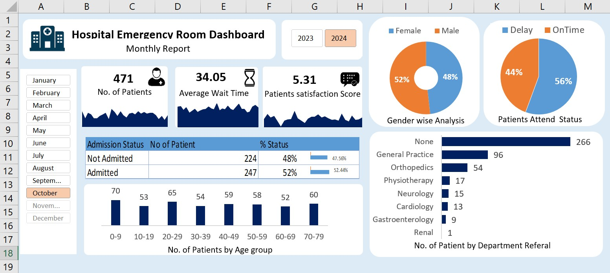

# Hospital-Emergency-Room-Dashboard

## 📌 Project Overview
Built an **interactive Excel dashboard** to analyze hospital ER patient visits, wait times, satisfaction scores, and demographic trends.  
The dashboard provides **actionable insights** to help hospital administrators optimize staffing, reduce wait times, and improve patient satisfaction.

**Records:** 4,700+ ER patient visits  
**Tools:** Microsoft Excel (Pivot Tables, Charts, Slicers, Conditional Formatting, Power Query)

---

## 🔹 Data Cleaning & Preparation
- Automated data import, cleaning, and transformation using **Power Query**  
- Standardized column names and formats, removed duplicates, and verified data types  
- Prepared a clean dataset ready for pivot analysis and dashboard visualization

---

## 🔹 Analysis & Insights
- Tracked **monthly and yearly patient visit trends**  
- Calculated **average wait times** by department and peak hours  
- Evaluated **patient satisfaction scores** and **demographic trends** (gender, age group, department)  
- Identified **peak ER hours** and high-traffic departments to support **data-driven decisions**

### Key Insights
- Peak ER visits occur on **Tuesdays around 4 PM**  
- **Neurology** department had the highest average wait time  
- Adult patients accounted for the majority of visits  
- Average patient satisfaction score ranged **3.9–6.6/7**

---

## 🔹 Dashboard Features
- **Pivot Tables & Charts:** Analyze visits, wait times, satisfaction, and demographics  
- **Slicers:** Filter by month, year, or department for interactive exploration  
- **Conditional Formatting:** Highlight key metrics and trends  
- **Power Query:** Streamline workflow and automate updates  

**Dashboard Preview:**  

---

## 💻 Skills Demonstrated
- Excel: Pivot Tables, Charts, Slicers, Conditional Formatting  
- Power Query: Data import, cleaning, transformation, automation  
- Data Analysis: Trend analysis, KPI calculation, demographic breakdowns  
- Data Visualization: Interactive dashboards and actionable insights

---

## 🙌 Acknowledgment
Inspired by **Satish Dhawale’s Excel Dashboard tutorials**
